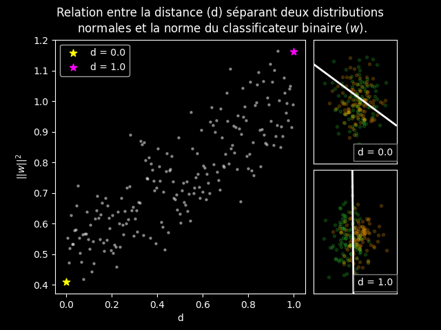
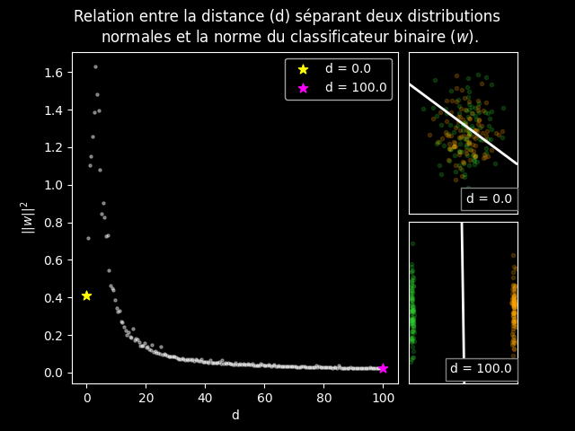
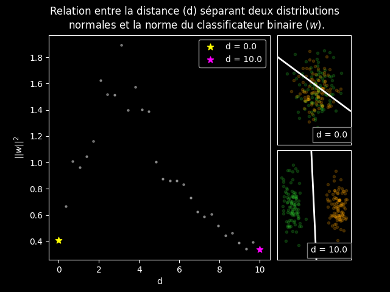
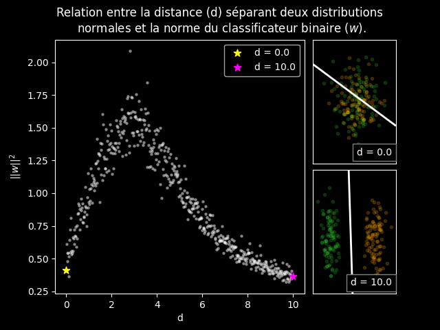
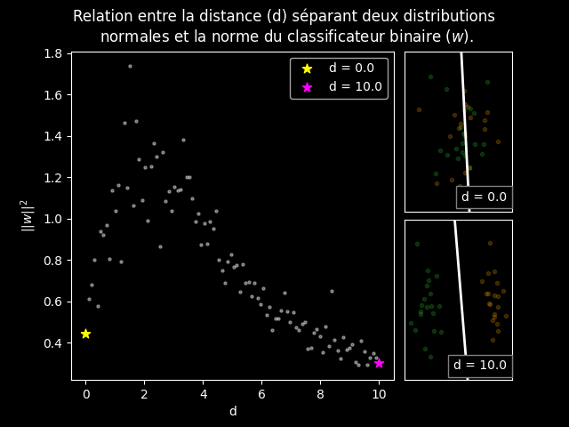
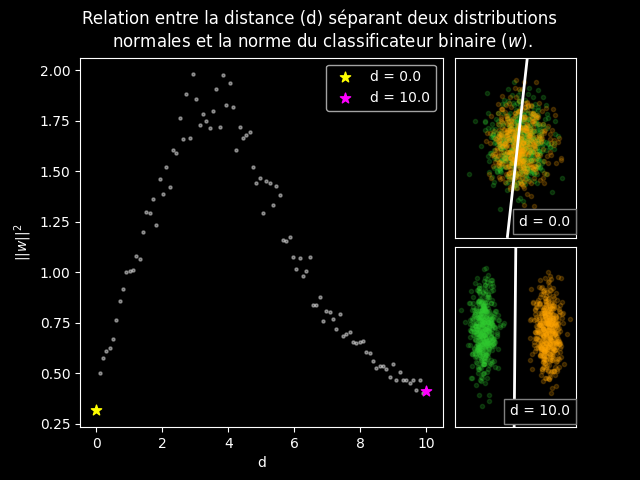
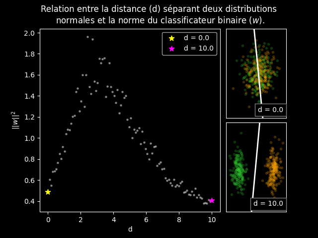
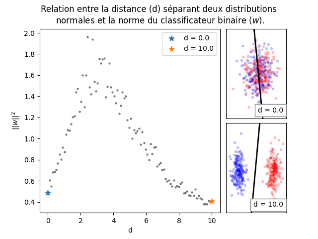

# Exécution du code et modification du graphique:

Pour produire un graphique, il s'agit d'exécuter le script "main.py". Assurez-vous d'avoir le script "fonctions.py" dans le même dossier que le script "main.py". Pour modifier le graphique, il faut modifier les paramètres donnés dans à la fonction build_graph_d_w:

1. Ouvrir le fichier "main.py" avec un éditeur de code.
2. Modifier les paramètre aux lignes 7 à 12.
3. Enregistrer les modifications.
4. Exécuter le script "main.py".

Le graphique sera enregistré automatiquement dans le dossier du script sous le nom de fichier "relation_d_w.png".

# Paramètres:

- list_d:
    Ce paramètre représente les distances d'intérêt auxquelles nous désirons voir une affichage des distributions. Vous pouvez donner un nombre arbitraire de distances. Cependant, après 8 distances, le résultat sera moins joli.

    Noter que le code construit le graphique à l'aide des valeurs extrêmes fournies (le minimum et le maximum):
    <table>
    <tr>
    <th>[0, 1]
    </th>
    <th>[0, 100]
    </th>
    </tr>
    <tr>
    <th>
    
    </th>
    <th>
    
    </th>
    </tr>
    </table>

- C : Paramètre de régularisation à utiliser pour l'algorithme SVM.
- nb_simulation : Nombre de simulation à exécuter. Ceci se traduit par le nombre de points dans le graphique.
    <table>
    <tr>
    <th>30
    </th>
    <th>500
    </th>
    </tr>
    <tr>
    <th>
    
    </th>
    <th>
    
    </th>
    </tr>
    </table>
- nb_data : Nombre d'exemples par distribution.
    <table>
    <tr>
    <th>20
    </th>
    <th>500
    </th>
    </tr>
    <tr>
    <th>
    
    </th>
    <th>
    
    </th>
    </tr>
    </table>
- dark_mode : Modifie l'apparence du graphique.
    <table>
    <tr>
    <th>True
    </th>
    <th>False
    </th>
    </tr>
    <tr>
    <th>
    
    </th>
    <th>
    
    </th>
    </tr>
    </table>
- seed : Seed pour la randomization.

# Reproduction de la figure :
Voici les paramètres utilisés pour produire la figure fournie dans le rapport:

```py
build_graph_d_w(
                    list_d=[0, 2, 3, 4, 8, 30],
                    C=1,
                    nb_simulation=200,
                    nb_data=180,
                    dark_mode=True,
                    seed=1,
                )
```